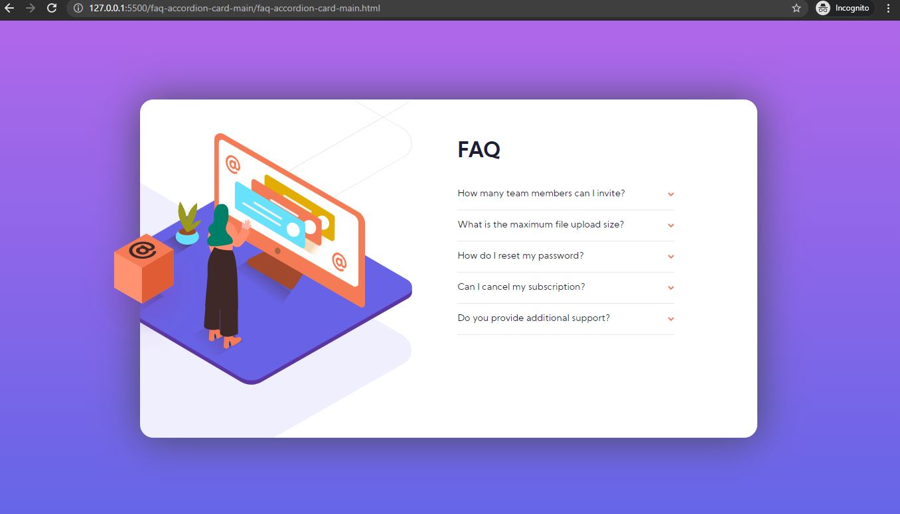

# Frontend Mentor - FAQ accordion card solution

This is a solution to the [FAQ accordion card challenge on Frontend Mentor](https://www.frontendmentor.io/challenges/faq-accordion-card-XlyjD0Oam). Frontend Mentor challenges help you improve your coding skills by building realistic projects.

## Table of contents

- [Overview](#overview)
  - [The challenge](#the-challenge)
  - [Screenshot](#screenshot)
  - [Links](#links)
- [My process](#my-process)
  - [Built with](#built-with)
  - [What I learned](#what-i-learned)
  - [Continued development](#continued-development)
  - [Useful resources](#useful-resources)
- [Author](#author)

**Note: Delete this note and update the table of contents based on what sections you keep.**

## Overview

### The challenge

Users should be able to:

- View the optimal layout for the component depending on their device's screen size
- See hover states for all interactive elements on the page
- Hide/Show the answer to a question when the question is clicked

### Screenshot

### Links

- [Solution URL](https://github.com/nyxraven/frontendmentor-challenges/tree/master/faq-accordion-card-main)
- [Live Site URL](https://nyxraven.github.io/frontendmentor-challenges/faq-accordion-card-main/faq-accordion-card-main.html)

## My process

### Built with

- Semantic HTML5 markup
- CSS custom properties
- Flexbox
- Mobile-first workflow
- A bit of JS

**Note: These are just examples. Delete this note and replace the list above with your own choices**

### What I learned

- Positioning background images in CSS
- Adding/removing a class with Javascript

### Continued development

- Would have liked the transtions between breaking points to be smoother.

### Useful resources

- [Autoprefixer](https://marketplace.visualstudio.com/items?itemName=mrmlnc.vscode-autoprefixer) - This helped me ato automatically dd vendor prefixes for different browsers.
- [W3Schools](https://www.w3schools.com/howto/howto_js_accordion.asp) - This helped me with creating the accordion thingie and understanding how I should set the elements
- [Stackoverflow](https://stackoverflow.com/questions/7678883/is-it-better-to-define-images-in-direct-html-or-css) helped me a bit with understanding where I should put my images in HTML or CSS, basically if the image has a context in page structure (logo, photo) it should go in the HTML, if it's only decorative -> CSS
- [Lighthouse](https://developers.google.com/web/tools/lighthouse) - to see how much did I fail (It has audits for performance, accessibility, progressive web apps, SEO and more.)

## Author

- Frontend Mentor - [@nyxraven](https://www.frontendmentor.io/profile/nyxraven)
- Twitter - [@NyxLearns](https://www.twitter.com/nyxlearns)

**Note: Delete this note and add/remove/edit lines above based on what links you'd like to share.**
