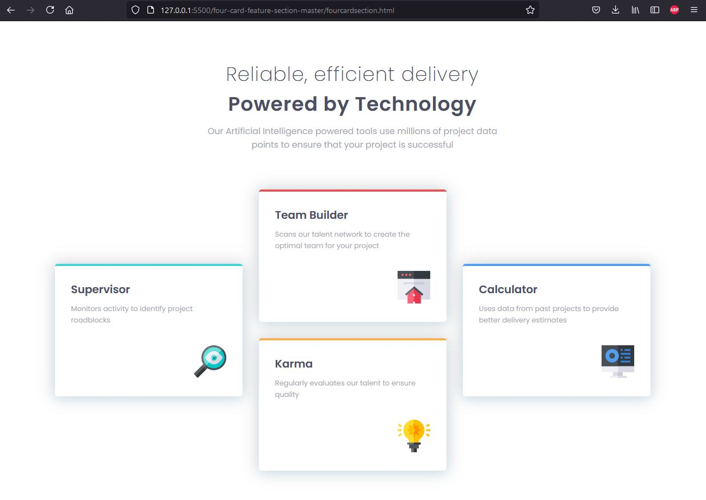

# Frontend Mentor - Four card feature section solution

This is a solution to the [Four card feature section challenge on Frontend Mentor](https://www.frontendmentor.io/challenges/four-card-feature-section-weK1eFYK). Frontend Mentor challenges help you improve your coding skills by building realistic projects.

## Table of contents

- [Overview](#overview)
  - [The challenge](#the-challenge)
  - [Screenshot](#screenshot)
  - [Links](#links)
- [My process](#my-process)
  - [Built with](#built-with)
- [Author](#author)

**Note: Delete this note and update the table of contents based on what sections you keep.**

## Overview

### The challenge

Users should be able to:

- View the optimal layout for the site depending on their device's screen size

### Screenshot

### Links

- [Solution URL](https://github.com/nyxraven/frontendmentor-challenges/tree/master/four-card-feature-section-master)
- [Live Site URL](https://nyxraven.github.io/frontendmentor-challenges/four-card-feature-section-master/fourcardsection.html)

## My process

### Built with

- Semantic HTML5 markup
- CSS custom properties
- Flexbox
- CSS Grid
- Mobile-first workflow

**Note: These are just examples. Delete this note and replace the list above with your own choices**

### What I learned

## Author

- Frontend Mentor - [@nyxraven](https://www.frontendmentor.io/profile/nyxraven)
- Twitter - [@NyxLearns](https://www.twitter.com/nyxlearns)

**Note: Delete this note and add/remove/edit lines above based on what links you'd like to share.**
