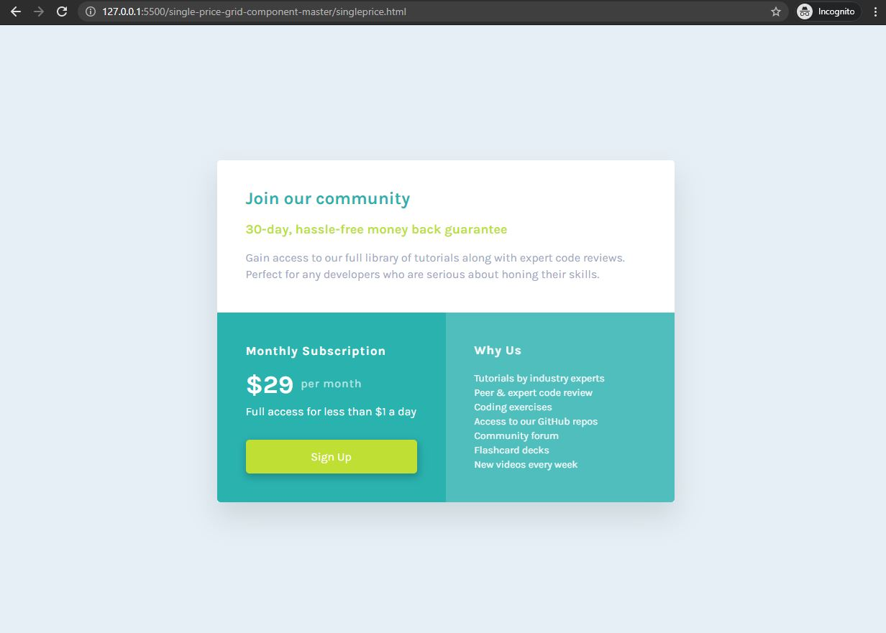

# Frontend Mentor - Profile card component solution

This is a solution to the [Profile card component challenge on Frontend Mentor](https://www.frontendmentor.io/challenges/profile-card-component-cfArpWshJ). Frontend Mentor challenges help you improve your coding skills by building realistic projects.

## Table of contents

- [Overview](#overview)
  - [The challenge](#the-challenge)
  - [Screenshot](#screenshot)
  - [Links](#links)
- [My process](#my-process)
  - [Built with](#built-with)
  - [What I learned](#what-i-learned)
  - [Useful resources](#useful-resources)
- [Author](#author)
- [Acknowledgments](#acknowledgments)

**Note: Delete this note and update the table of contents based on what sections you keep.**

## Overview

### The challenge

- Build out the project to the designs provided

### Screenshot

### Links

- [Solution URL](https://github.com/nyxraven/frontendmentor-challenges/tree/master/single-price-grid-component-master)
- [Live Site URL](https://nyxraven.github.io/frontendmentor-challenges/single-price-grid-component-master/singleprice.html)

## My process

### Built with

- Semantic HTML5 markup
- CSS custom properties
- Flexbox & Grid
- Mobile-first workflow

### What I learned

- Playing with grid element
- :nth-of-type selector allows you select one or more elements based on their source order

### Useful resources

- [CSS Tricks](https://css-tricks.com/snippets/css/complete-guide-grid/) - This helped me with the understanding of grid elements

## Author

- Frontend Mentor - [@nyxraven](https://www.frontendmentor.io/profile/nyxraven)
- Twitter - [@NyxLearns](https://www.twitter.com/nyxlearns)

**Note: Delete this note and add/remove/edit lines above based on what links you'd like to share.**
